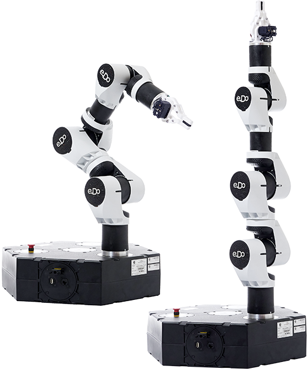
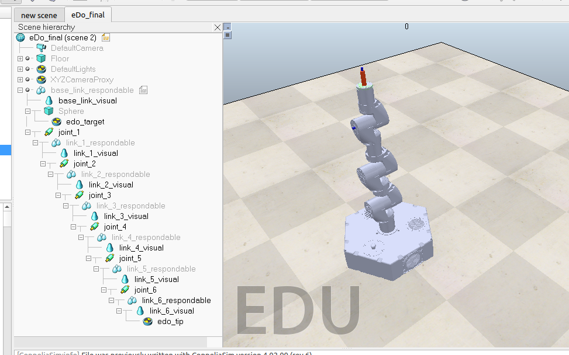
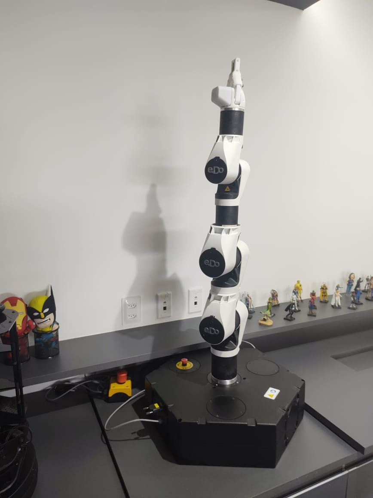

# EDO Simualtion-to-Reality API

=======================================

The present a framework reponsible to establish a comunication between a 
script moviment test for E.Do robot and the simulated version of the robot made in SimCoppleia Simulator.

The robot used in this project was the  E.Do Robot developed by <a href="https://edo.cloud/">Comau company</a>. That has also has a framework 
<a href="https://github.com/Comau/pyedo"><i>pyedo</i></a> responsible for controling the robot, this framework allows to
parameterized moviments and others actions. We adapted some of the <i>pyedo</i> fuctions:
- <b>.init7Axes()
- .MoveToHome()
- .MoveJoints()
- .moveCartesian()</b>
 

The <i>pyedo</i> functions were adapted to the simulation application on the [edoSim](edoconnect/edoSim.py) to communicate the test script with the <a href="https://www.coppeliarobotics.com/">SimCoppelia</a> simulated environment created for the E.Do robot. 

The adapted simulated code  was made using the python <a href="https://www.coppeliarobotics.com/helpFiles/en/remoteApiFunctionsPython.htm"> API</a> of SimCoppelia present on [edorobot](edoconnect/edorobot.py), was also necessary to adapt the scene to allow the implementation of the inverse kinematics movement, and also the simulation Lua [script](edoconnect/edo_robot_sim.lua).

There were two test movements tested: [Cartesean](edoconnect/movecartesian_test.py) oriented movement and  and [Joints](edoconnect/movejoints_test.py) oriented movement. And the validation of the script was made using the robot of the [Voxar Labs](https://voxarlabs.cin.ufpe.br/), on the Universidade Federal de Pernambuco(UFPE), thanks to João Marcelo Xavier Natario Texeira.

This Project made by Wallace Nascimento Melo was used as the Final Paper of his graduation of the Electronics Engineering Course.

 